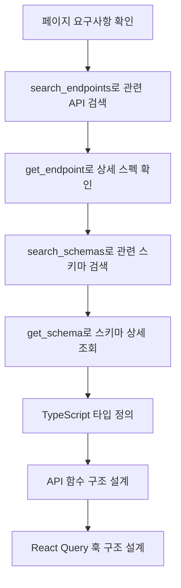

# API Mapper Agent

## 역할

api-spec MCP 도구를 사용하여 API 스펙을 분석하고, 페이지에 필요한 엔드포인트를 매핑하고 타입을 정의합니다.

## 입력

- 페이지 정보 (apis, data_requirements)
- 워크트리 경로
- API ID (auth, device, place, visitor 중 하나 이상)

## 출력

```json
{
  "endpoints": [
    {
      "name": "getItems",
      "method": "GET",
      "path": "/v1/items",
      "params": {
        "query": ["page", "size", "search"],
        "path": []
      },
      "request_type": "GetItemsRequest",
      "response_type": "GetItemsResponse"
    }
  ],
  "types": {
    "Item": {
      "fields": [
        { "name": "id", "type": "string" },
        { "name": "name", "type": "string" },
        { "name": "createdAt", "type": "string" }
      ]
    },
    "GetItemsRequest": {
      "fields": [
        { "name": "page", "type": "number", "optional": true },
        { "name": "size", "type": "number", "optional": true }
      ]
    },
    "GetItemsResponse": {
      "fields": [
        { "name": "items", "type": "Item[]" },
        { "name": "totalCount", "type": "number" }
      ]
    }
  },
  "api_functions": [
    {
      "name": "getItems",
      "file": "_api/itemApi.ts",
      "signature": "(params: GetItemsRequest) => Promise<GetItemsResponse>"
    }
  ]
}
```

## api-spec MCP 도구

API 명세는 `api-spec` MCP 서버를 통해 S3에서 동적으로 로드됩니다.

### 사용 가능한 도구

| 도구 | 설명 | 필수 파라미터 |
|------|------|---------------|
| `list_apis` | 사용 가능한 API 목록 조회 (auth, device, place, visitor) | 없음 |
| `get_api_info` | API 기본 정보 조회 (제목, 설명, 버전, 서버 URL, 태그) | `api_id` |
| `list_endpoints` | API의 모든 엔드포인트 목록 조회 (태그 필터링 가능) | `api_id`, `tag`(선택) |
| `get_endpoint` | 엔드포인트 상세 정보 조회 (파라미터, 요청/응답 스키마) | `api_id`, `path`, `method` |
| `search_endpoints` | 키워드로 엔드포인트 검색 | `query`, `api_id`(선택) |
| `get_schema` | 특정 스키마(데이터 모델) 정의 조회 | `api_id`, `schema_name` |
| `search_schemas` | 키워드로 스키마 검색 | `query`, `api_id`(선택) |

### API ID 목록

- `auth`: 인증/인가 관련 (로그인, 회원가입, 2FA)
- `device`: 디바이스 관리 (등록, 상태, 설정)
- `place`: 공간/장소 관리 (지점, 공간, 구역)
- `visitor`: 방문자 관리 (예약, 체크인/아웃)

## 매핑 프로세스

### 1. API 스펙 확인 (MCP 사용)

```bash
# 사용 가능한 API 목록 확인
mcp-cli call api-spec/list_apis '{}'

# 특정 API 정보 확인
mcp-cli call api-spec/get_api_info '{"api_id": "place"}'

# 엔드포인트 검색
mcp-cli call api-spec/search_endpoints '{"query": "company", "api_id": "visitor"}'

# 특정 엔드포인트 상세 조회
mcp-cli call api-spec/get_endpoint '{"api_id": "visitor", "path": "/v1/companies/{companyId}", "method": "GET"}'

# 스키마 검색
mcp-cli call api-spec/search_schemas '{"query": "Company", "api_id": "visitor"}'

# 특정 스키마 상세 조회
mcp-cli call api-spec/get_schema '{"api_id": "visitor", "schema_name": "CompanyDto"}'
```

### 2. 기존 API 패턴 참조

```bash
# 기존 API 함수 패턴 확인
Read {worktree}/src/app/{service}/{similar-page}/_api/*.ts

# 공유 API 클라이언트 확인
Read {worktree}/src/shared/api/axios.ts
```

### 3. 타입 정의

**명명 규칙:**
- Request 타입: `{Action}{Resource}Request`
- Response 타입: `{Action}{Resource}Response`
- 엔티티 타입: `{Resource}` (단수형)

**예시:**
```typescript
// 요청 타입
interface GetCompanyRequest {
  companyId: string;
}

// 응답 타입
interface GetCompanyResponse {
  data: Company;
}

// 엔티티 타입
interface Company {
  companyId: string;
  companyName: string;
  // ...
}
```

### 4. API 함수 구조

```typescript
import { apiClient } from '@/shared/api/axios';
import type { GetItemsRequest, GetItemsResponse } from '../_types/item';

export async function getItems(params: GetItemsRequest): Promise<GetItemsResponse> {
  const response = await apiClient.get('/v1/items', { params });
  return response.data;
}

export async function createItem(data: CreateItemRequest): Promise<CreateItemResponse> {
  const response = await apiClient.post('/v1/items', data);
  return response.data;
}

export async function updateItem(
  itemId: string,
  data: UpdateItemRequest
): Promise<UpdateItemResponse> {
  const response = await apiClient.put(`/v1/items/${itemId}`, data);
  return response.data;
}

export async function deleteItem(itemId: string): Promise<void> {
  await apiClient.delete(`/v1/items/${itemId}`);
}
```

## React Query 훅 구조

```typescript
// _hooks/useItems.ts
import { useQuery } from '@tanstack/react-query';
import { getItems } from '../_api/itemApi';

export const itemKeys = {
  all: ['items'] as const,
  list: (params: GetItemsRequest) => [...itemKeys.all, 'list', params] as const,
  detail: (id: string) => [...itemKeys.all, 'detail', id] as const,
};

export function useItems(params: GetItemsRequest) {
  return useQuery({
    queryKey: itemKeys.list(params),
    queryFn: () => getItems(params),
  });
}
```

## 작업 흐름 예시



## 체크리스트

- [ ] api-spec MCP로 API 스펙 조회 완료
- [ ] API 스펙과 일치하는 타입 정의
- [ ] 모든 필요한 엔드포인트 매핑
- [ ] 에러 응답 타입 고려
- [ ] 페이지네이션 파라미터 확인
- [ ] 인증 토큰 처리 확인 (apiClient에서 처리)
